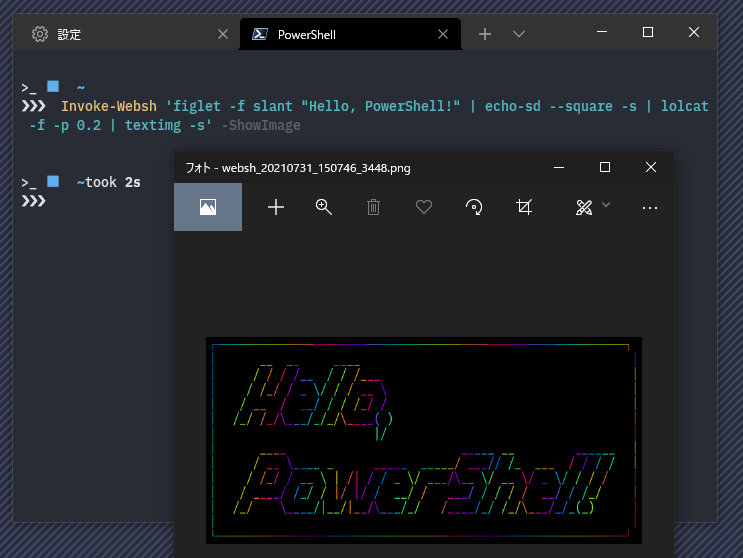

# 🐚 pswebsh

<p align="right"></p>

PowerShellから [websh](https://github.com/jiro4989/websh) のAPIを使ってシェル芸を実行するCLIクライアント。

<div align="center"></div>

## 機能

- シェル芸の実行
- 実行結果の出力
- 画像の投稿
- 実行結果の画像をローカルに保存
- 保存した画像をデフォルトの画像ビューアで開く(`-ShowImage` スイッチを付けると有効になります。)

## 環境・バージョン

以下の環境でテストしています。

- PowerShell Core 7.0.3 (Windows/Linux)
- Windows PowerShell 5.1 (Windows)

## 使い方

### シェル芸を実行

`-Code` パラメータに記述するか、パイプラインから入力します。

```pwsh
PS> Invoke-Websh -Code 'uname -a'

Linux e9b38cbb8ec8 4.15.0-55-generic #60-Ubuntu SMP Tue Jul 2 18:22:20 UTC 2019 x86_64 x86_64 x86_64 GNU/Linux

PS> 'uname -a' | Invoke-Websh

Linux d643fdbf8022 4.15.0-55-generic #60-Ubuntu SMP Tue Jul 2 18:22:20 UTC 2019 x86_64 x86_64 x86_64 GNU/Linux
```

`-Code` パラメータを指定しない場合はプロンプトが表示されます。

```pwsh
PS> Invoke-Websh

cmdlet Invoke-Websh at command pipeline position 1

Supply values for the following parameters:

Code: echo hello

hello
```

### 実行結果の画像を保存

シェル芸bot上の `/images/` に保存した画像は、ローカルのtempディレクトリ以下に保存されます。

- Windows: `%LOCALAPPDATA%\Temp\websh`
- Linux: `/tmp/websh`

`-ShowImage` スイッチを付けると、保存した画像をデフォルトの画像ビューアで開きます。

```pwsh
PS> 'screenfetch | textimg -s' | Invoke-Websh -ShowImage
```

### 保存した画像をまとめて削除

保存した画像をまとめて削除するには、`Clear-WebshImageCache` コマンドレットを使います。

### 画像を投稿

- `-UploadImages` パラメータに画像ファイルのパスを指定します。
- 複数枚の画像を投稿するには、画像ファイルのパスを `,`で区切ります。
- シェル芸bot・webshの仕様上最大4枚まで投稿できます。
- 投稿した画像は、シェル芸botイメージ上の `/media/0` ～ `/media/3` に配置されます。

```
PS> Invoke-Websh -UploadImages ./hoge.png, ./fuga.png -Code 'ls -l /media'
合計 96
-rw-r--r-- 1 root root 48877  3月 24 23:57 0
-rw-r--r-- 1 root root 48670  3月 24 23:57 1
```

### サーバーの状態を確認

`Test-WebshStatus` コマンドレットでサーバーの状態を確認することができます。

```powershell
PS> Test-WebshStatus

```

## インストール

依存するモジュールやCLIツール等はありません。このリポジトリをcloneして `Import-Module` で読み込みます。

```powershell
# cd to module root dir
cd ~/Documents/WindowsPowerShell/Modules/ # Windows PowerShell
cd ~/Documents/PowerShell/Modules/        # PowerShell Core on Windows
cd ~/.config/PowerShell/Modules/          # PowerShell Core on Linux

# clone this repository
git clone https://github.com/sheepla/PsWebsh.git
# import this module
Import-Module PsWebsh
```

PowerShellの起動時に自動で読み込ませたい場合は、`$PROFILE` ファイルに以下の行を追記してください。

```powershell
Import-Module PsWebsh
```

## 謝辞

[jiro4989](https://github.com/jiro4989) 様の [websh](https://github.com/jiro4989/websh) APIを利用しています。
素晴らしいサービスをありがとうございます。

